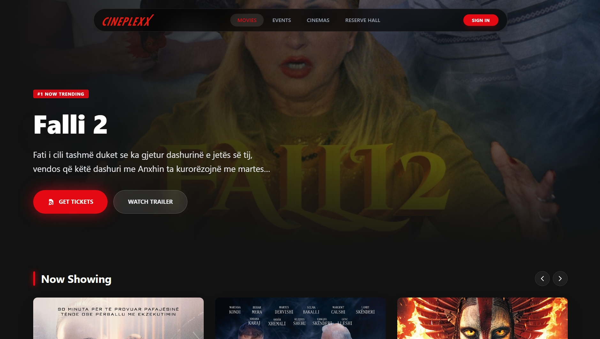

# Cineplexx CMS (Cinema Management System)

A fully-featured, full-stack Cinema Management System designed to handle movie browsing, interactive seat booking, and administrative movie management. Built with modern web technologies, this project showcases a complete end-to-end user and admin experience.

## 🌐 Live Demo

**Check out the live application here:** [Cineplexx CMS Live](https://cineplexx-al.vercel.app)



> **⚠️ Important Notice Regarding the Live Environment:**
> The backend of this application is hosted on Render's free tier. To conserve resources, Render automatically spins down free web services into an "idle mode" after 15 minutes of inactivity. 
> 
> **When accessing the site for the first time (or after a period of inactivity), the initial data load might take up to 50 seconds while the server wakes up.** If the movies aren't loading immediately, please be patient for a few moments and refresh the page. Everything will run smoothly and quickly once the server is awake!

## 🚀 Features

### 🍿 User Experience:
- **Movie Catalog:** Browse currently showing movies with detailed views and high-quality posters.
- **Interactive Booking:** Select showtimes and pick seats using a dynamic, interactive seat selection grid.
- **Authentication:** Secure user registration, robust login, and profile management.
- **Digital Tickets:** Generates booking confirmations, complete with downloadable tickets (PDFs) and QR codes.

### 🛡️ Administrative Controls:
- **Admin Dashboard:** Dedicated interface for cinema managers.
- **Content Management:** Seamlessly add new movies, update details, and manage showtimes.
- **Cloud Storage:** Integrated with Cloudinary for fast and reliable movie poster image uploads.

## 💻 Tech Stack

**Frontend:**
- **Framework:** React 19 (via Vite)
- **Styling:** Tailwind CSS & PostCSS
- **Routing:** React Router DOM
- **Utilities:** Axios (API interactions), Lucide React (Icons), jsPDF & html2canvas (Ticket generation), QRCode.react

**Backend:**
- **Runtime & Framework:** Node.js & Express.js
- **Database:** PostgreSQL (hosted on Neon.tech) 
- **ORM:** Sequelize
- **Authentication & Security:** JSON Web Tokens (JWT), bcryptjs, CORS
- **File Uploads:** Multer, Cloudinary Integration

## 🛠️ Local Setup and Installation

Follow these steps to get the project running on your local machine.

### Prerequisites
- Node.js (v18+ recommended)
- A PostgreSQL database URI (or an account on Neon.tech/Supabase)
- A Cloudinary account for handling image uploads

### 1. Clone the Repository
```bash
git clone <your-github-repo-url>
cd Cinema_Management_System
```

### 2. Backend Setup
Navigate to the `server` directory and install the necessary dependencies:
```bash
cd server
npm install
```

Create a `.env` file in the `server` directory and provide your keys:
```env
# Server Configuration
PORT=5000

# Database Configuration
DATABASE_URL=your_postgresql_connection_string

# Authentication
JWT_SECRET=your_jwt_secret_key

# Cloudinary Storage
CLOUDINARY_CLOUD_NAME=your_cloudinary_cloud_name
CLOUDINARY_API_KEY=your_cloudinary_api_key
CLOUDINARY_API_SECRET=your_cloudinary_api_secret
```

Start the backend API server:
```bash
node server.js
```

### 3. Frontend Setup
Open a new terminal window, navigate to the `client` directory, and install its dependencies:
```bash
cd client
npm install
```

Configure the environment by creating a `.env` file inside the `client` directory:
```env
VITE_API_URL=http://localhost:5000/api
```

Start the Vite development server:
```bash
npm run dev
```

The frontend should now be running locally at `http://localhost:5173`.

## 📜 License
This project is open-source and available under the MIT License.
